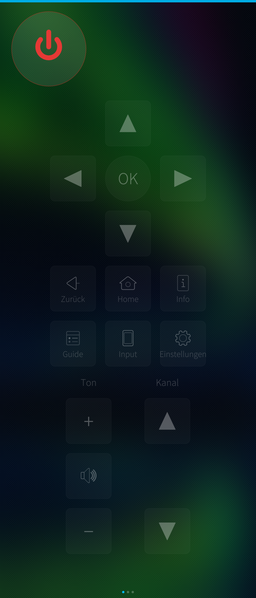
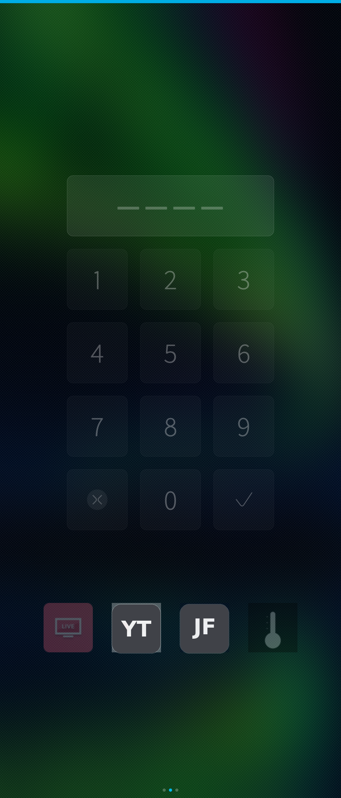
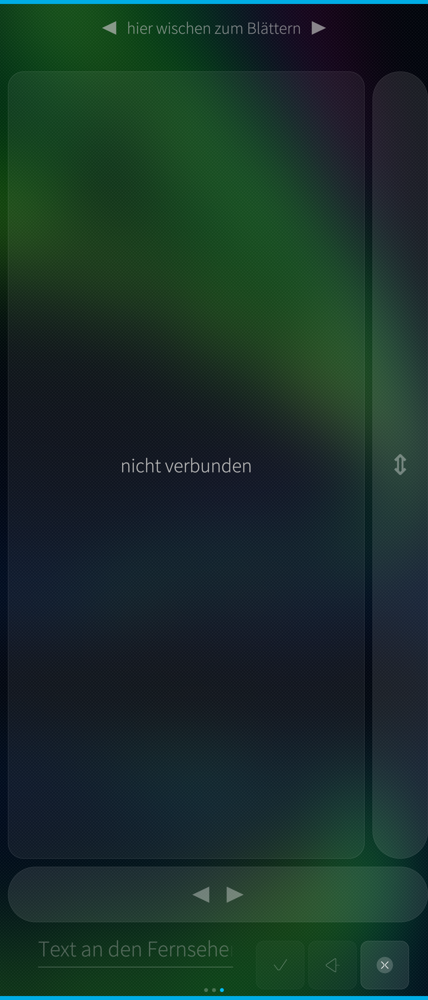

# iLG remote

A native **SailfishOS** remote control for **LG webOS** televisions.

It speaks the LG **SSAP** WebSocket protocol (over TLS) directly — d-pad,
volume, channels, inputs, media keys, a pointer/touchpad, a number pad and app
launching — and powers the TV on with **Wake-on-LAN**. TVs are found by SSDP
discovery (or a quick port scan), and several TVs can be stored and switched
between.

> Package id: `harbour-lgremote`. Built and used on a Sony Xperia 10 III
> (SailfishOS 5.x). The UI is German.

|  |  |  |
|---|---|---|
|  |  |  |

*(The three carousel pages — remote, number pad, pointer. App-launch logos are
shown as neutral placeholders.)*

## Features

* Pairing with the TV's prompt; the per-device client key is stored locally.
* Directional pad, OK/Back/Home, volume and channel, input switching.
* A pointer / touchpad panel (magic-remote style) and an on-screen keyboard bridge.
* Number pad and quick app-launch buttons (edit the app ids to match your TV).
* **Wake-on-LAN** power-on via a magic packet.
* **Discovery** by SSDP, plus an optional port scan of the local subnet.
* Multiple devices — add, edit and switch between TVs.
* A cover with play/pause and connection state.

## Building

Uses the SailfishOS Platform SDK (`mb2`):

```sh
mb2 -t <target> build
```

Requires `qt5-qtwebsockets`, `nemo-qml-plugin-configuration-qt5` and the usual
Sailfish/Qt5 build dependencies (see `rpm/harbour-lgremote.spec`).

## Status

**Proof of concept / work in progress.** A hobby project, shared **as is** with
**no warranty** of any kind (see [LICENSE](LICENSE)). It may be incomplete,
rough around the edges, or change without notice — use it at your own risk. It
talks only to **your own** TV on your own network.

## License

MIT — see [LICENSE](LICENSE) and [THIRD-PARTY-NOTICES.md](THIRD-PARTY-NOTICES.md).
